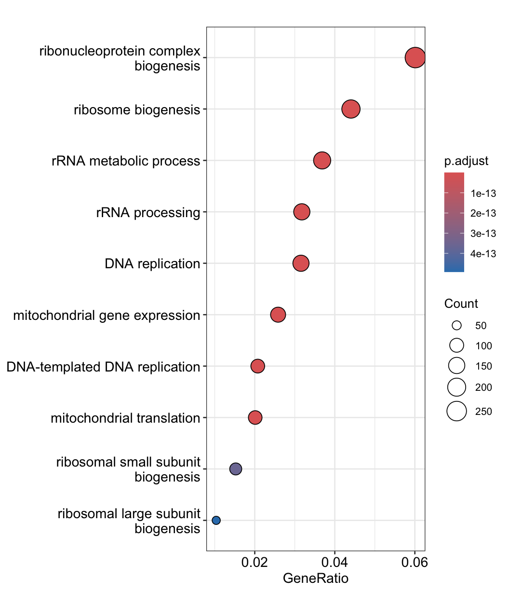
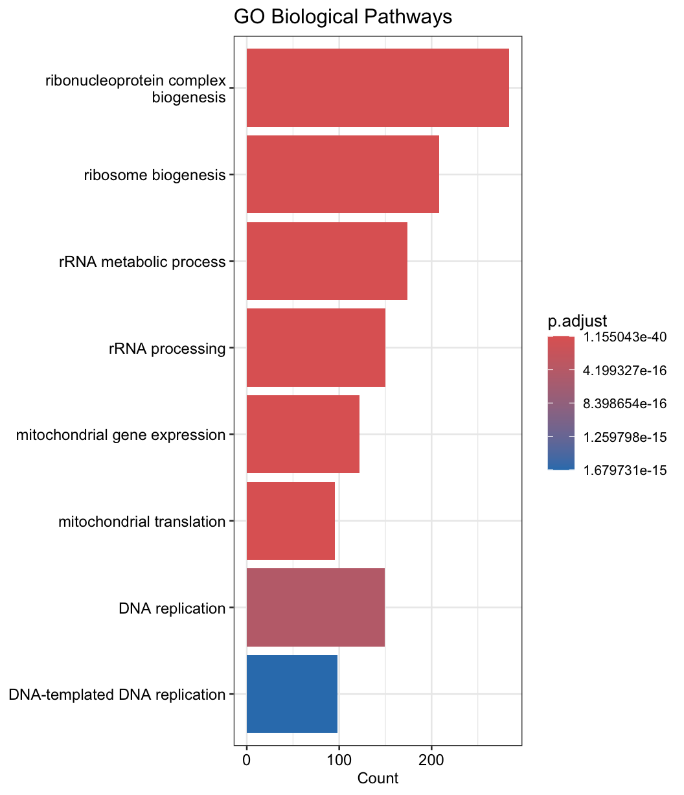
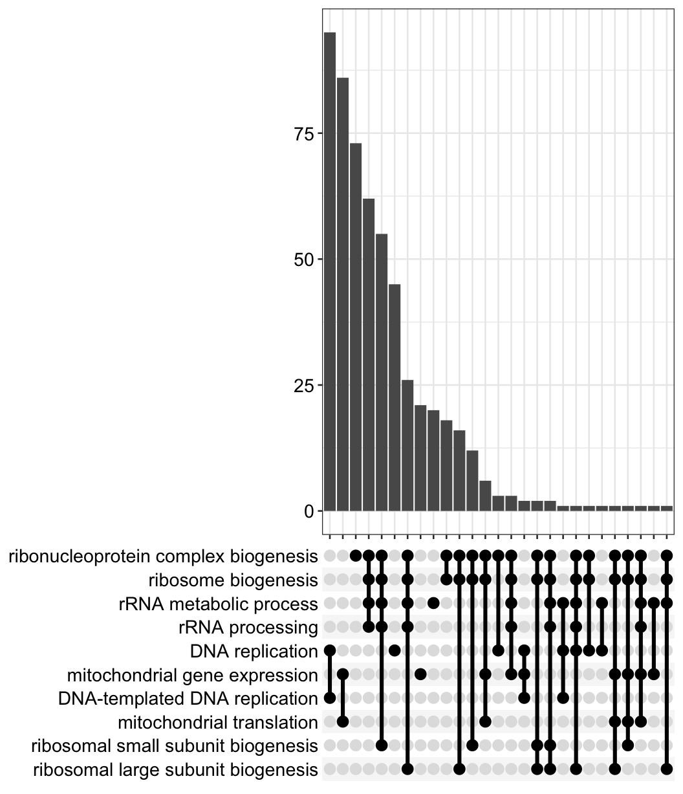
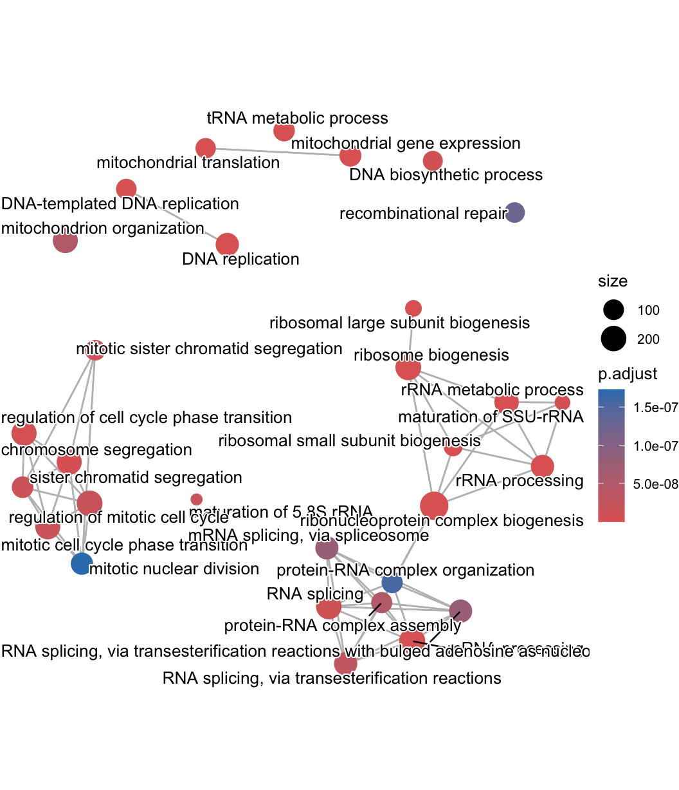

# RStudio_RNAseq_MYCcsControldataAnalysis

This code performs a standard Differential Expression (DE) analysis pipeline, taking raw count data (likely from Galaxy/FeatureCounts), running it through DESeq2, and annotating the results.

This repository contains a comprehensive bioinformatics R workflow designed to analyze RNA-Seq data. The suite is divided into two analytical modules that process raw feature counts (from Galaxy) to characterize the differences between MYC (Condition) and CN (Control) samples:

Module A: Differential Expression & Heatmap Visualization
Focuses on identifying significant genes and generating publication-quality heatmaps (Global patterns and Top 20 targets).

Key Features
Statistical Model: Uses DESeq2 (Wald test) to identify differentially expressed genes.
Global Heatmap: Visualizes all significantly differentially expressed genes ($P_{adj} < 0.05$) using row-scaled Z-scores to show relative up/down-regulation.
Top 20 Heatmap: Sorts genes by statistical significance and plots the top 20 using $Log_2(Counts + 1)$ transformation for precise expression comparison.OutputsDESeq2 

Object: Stored as dds.Heatmap 1: Global significance patterns.Heatmap 2: Top 20 most significant genes.

Outputs:
DESeq2 Object: Stored as dds.

Heatmap 1: Global significance patterns.

Heatmap 2: Top 20 most significant genes.

Module B: Functional Pathway Enrichment
Moves beyond simple gene lists to identify biological processes using Gene Set Enrichment Analysis (GSEA) and Over-Representation Analysis (ORA).

Key Features
ID Mapping: Automatically converts Entrez IDs to HUGO Gene Symbols.
Gene Set Enrichment Analysis (GSEA):Uses a ranked list of all genes (sorted by Log2 Fold Change).Identifies activated vs. suppressed biological processes independent of arbitrary p-value cutoffs.
Over-Representation Analysis (ORA):Focuses strictly on significantly differentially expressed genes ($P_{adj} < 0.05$).Tests for statistical enrichment of GO terms.
Network Visualization:Enrichment Map (emapplot): Clusters related pathways into networks.
Gene-Concept Network (cnetplot): Links specific genes to the biological concepts they drive.

Outputs:
GSEA Dot Plot: Pathway enrichment split by activation status.

GO Bar Plot: Top biological processes.

Upset Plot: Intersections between gene sets.

Network Plots: emapplot and cnetplot for systems biology visualization.

